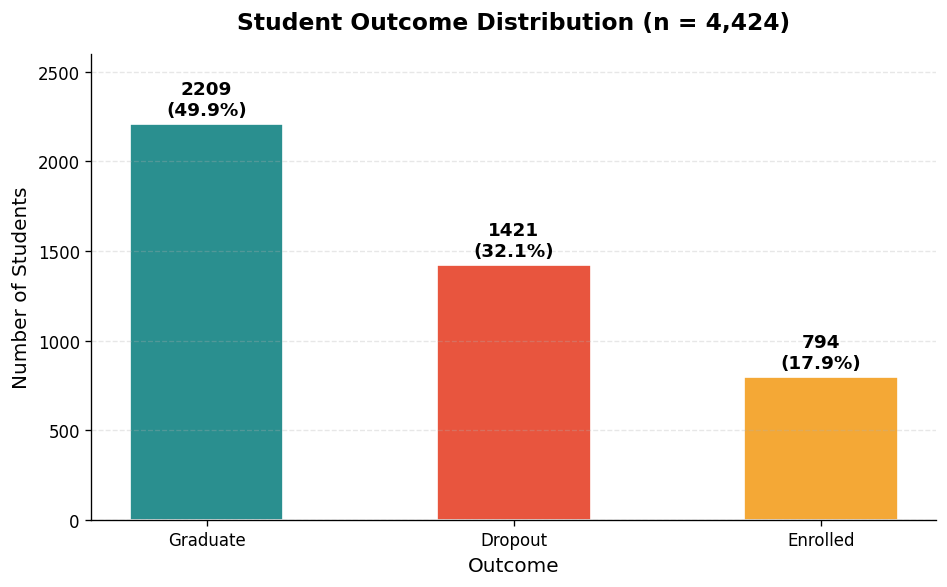
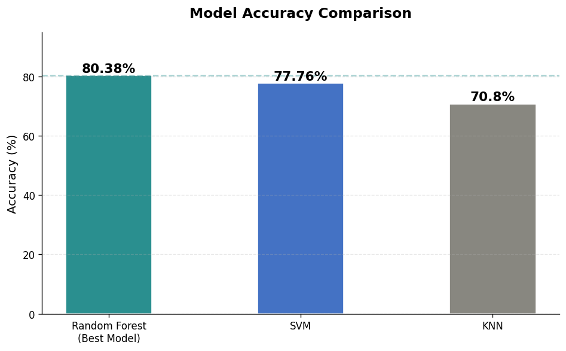
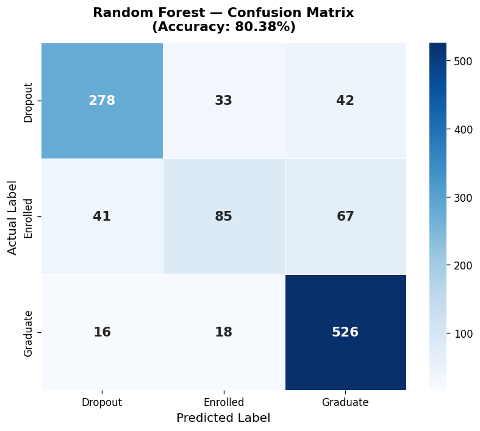
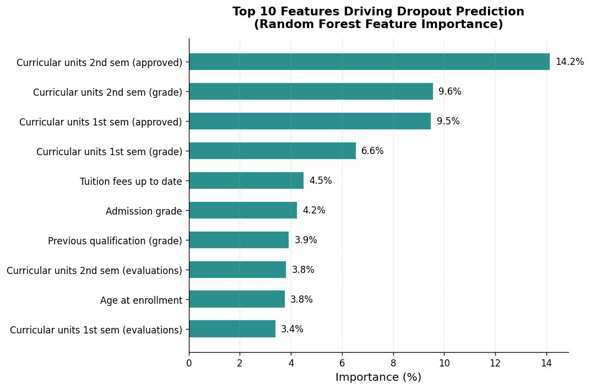
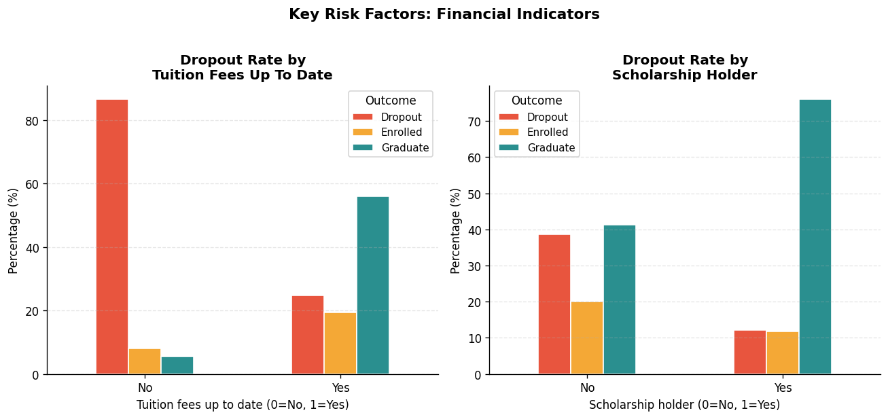

# 🎓 Student Dropout Prediction using Machine Learning


> Predicting whether a student will **drop out**, remain **enrolled**, or **graduate** using supervised machine learning — enabling institutions to intervene early and improve student success rates.

---

## 📌 Problem Statement

Student dropout is one of the most significant challenges in higher education, leading to lost potential, wasted resources, and societal costs. This project builds a machine learning pipeline to **predict student outcomes early** using demographic, academic, and socioeconomic data — giving institutions the ability to identify at-risk students and intervene before it's too late.

**Business Question:** *Can we predict which students are at risk of dropping out, and what are the most critical factors driving that risk?*

---

## 📊 Dataset

- **Source:** [UCI Machine Learning Repository — Predict Students' Dropout and Academic Success](https://archive.ics.uci.edu/dataset/697/predict+students+dropout+and+academic+success)
- **Size:** 4,424 students × 36 features
- **Target Classes:** Dropout (32.1%) · Enrolled (17.9%) · Graduate (49.9%)
- **Features include:** Academic performance, admission grades, financial status (tuition, scholarship), demographics (age, gender, nationality), macroeconomic indicators (GDP, unemployment rate)

### Target Distribution



---

## 🔧 Methodology

### 1. Data Understanding & EDA
- Explored 4,424 records across 37 variables
- Confirmed zero null values — dataset is clean
- Analysed feature distributions and correlation matrix
- Identified key risk indicators: tuition fee status, curricular unit performance, age at enrolment

### 2. Data Preprocessing
- Cleaned delimiter issues in raw CSV (semicolons → commas)
- Applied **StandardScaler** for feature normalisation
- Used **Stratified K-Fold Cross Validation** (k=5) to preserve class balance across folds
- 75/25 train-test split with `random_state=0` for reproducibility

### 3. Model Training & Hyperparameter Tuning
Three classification algorithms were trained and tuned using **GridSearchCV**:

| Model | Default Accuracy | Tuned Accuracy | Best Parameters |
|---|---|---|---|
| **Random Forest** | 76.2% | **80.38%** ✅ | n_estimators=500, criterion=gini, bootstrap=False |
| **SVM** | 77.3% | 77.76% | C=100, gamma=0.001, kernel=rbf |
| **KNN** | 64.0% | 70.80% | n_neighbors=19 |

### 4. Model Evaluation
- Accuracy, Precision, Recall, F1-Score per class
- Confusion Matrix analysis
- Feature Importance (Random Forest)

---

## 📈 Results

### Model Accuracy Comparison



### Best Model: Random Forest (80.38% Accuracy)



**Classification Report — Random Forest:**

| Class | Precision | Recall | F1-Score | Support |
|---|---|---|---|---|
| Dropout | 0.83 | 0.79 | 0.81 | 353 |
| Enrolled | 0.62 | 0.44 | 0.52 | 193 |
| Graduate | 0.83 | 0.94 | 0.88 | 560 |
| **Weighted Avg** | **0.79** | **0.80** | **0.79** | **1,106** |

---

## 🔍 Key Insights

### Top Predictive Features



### Critical Risk Factors



**What the data tells us:**

1. **Academic performance is the #1 predictor** — Students who fail to complete/approve curricular units in Semester 1 and 2 are significantly more likely to drop out. The top 4 features are all academic performance metrics.

2. **Financial status matters enormously** — Students who are NOT up to date with tuition fees show drastically higher dropout rates. Financial intervention programs could be highly effective.

3. **Scholarship holders are protected** — Scholarship students show much lower dropout rates, suggesting financial support is a powerful retention mechanism.

4. **Early warning is possible** — The model achieves 83% precision for identifying dropout students, meaning institutions can correctly flag 4 out of 5 at-risk students early enough to intervene.

5. **Enrolled class is hardest to predict** — F1 of 0.52 for the "Enrolled" class reflects genuine uncertainty in mid-progress students, which is expected in real-world scenarios.

---

## 💡 Business Recommendations

| Finding | Recommended Action |
|---|---|
| Low 2nd semester approvals → high dropout | Trigger academic support alerts after Week 4 |
| Tuition not up to date → high dropout | Proactive financial counselling outreach |
| Age at enrolment a key factor | Tailored support for non-traditional age students |
| Model: 83% dropout precision | Deploy as early-warning dashboard for academic advisors |

---

## 🛠️ Tech Stack

| Tool | Purpose |
|---|---|
| Python 3.8+ | Core programming |
| pandas, NumPy | Data manipulation |
| scikit-learn | ML models, cross-validation, GridSearchCV |
| Matplotlib, Seaborn | Visualisation |
| Jupyter Notebook | Development environment |

---

## 🚀 How to Run

```bash
# 1. Clone the repository
git clone https://github.com/rachel-raakhi/student-dropout-prediction.git
cd student-dropout-prediction

# 2. Install dependencies
pip install pandas numpy scikit-learn matplotlib seaborn jupyter

# 3. Launch the notebook
jupyter notebook "Student Dropout Prediction.ipynb"
```

---

## 📁 Repository Structure

```
student-dropout-prediction/
│
├── Student Dropout Prediction.ipynb   # Main analysis notebook
├── studentdata.csv.txt                # Dataset (comma-separated)
├── images/                            # All visualisation outputs
│   ├── 01_target_distribution.png
│   ├── 02_model_comparison.png
│   ├── 03_confusion_matrix.png
│   ├── 04_feature_importance.png
│   └── 05_risk_factors.png
└── README.md
```

---

## 📚 Citation

```
Realinho, V., Vieira Martins, M., Machado, J., & Baptista, L. (2021).
Predict students' dropout and academic success.
UCI Machine Learning Repository.
https://archive.ics.uci.edu/dataset/697/predict+students+dropout+and+academic+success
```

---

## 👩‍💻 Author

**Raakhi Rachel Jose**  
MSc Data Science (Distinction) — University of Essex, UK  
[LinkedIn](https://linkedin.com/in/raakhiracheljose) · [GitHub](https://github.com/rachel-raakhi)
